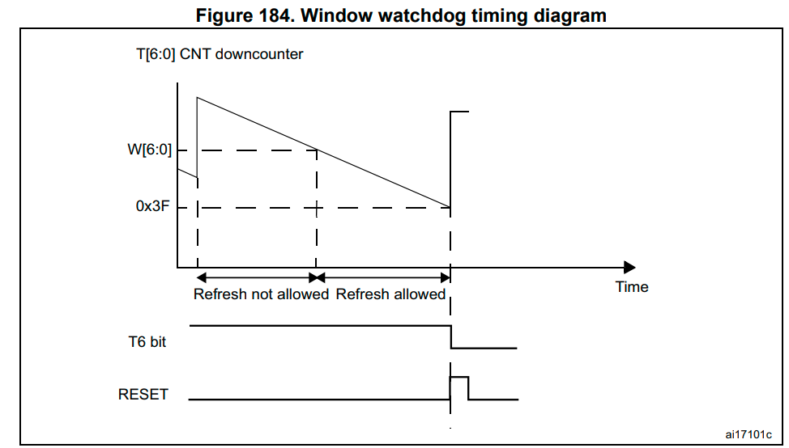

# Window Watchdog

### Working Concept

mainly it is a count down timer, counts from max to min value.
It will generate a reset if it reached the min value **OR** if it is refreshed outside the required window.
### Features
1. The window watchdog is used to detect the occurrence of
software faults.

2. The window watchdog can be programmed to detect
abnormally late or early application behavior.
- It is best suited for applications required to react within an
accurate timing window.
- Once enabled, it can only be disabled by a device reset, what if you want to diable it?

- Reset Generation ()
4. An Early Wakeup Interrupt can be generated before a reset
happens to perform a system recovery or manage certain
actions before a system restart like
    - data encryption
    - reset prevention
    - ...etc.

Task: Code design.

###### Refs
- STMicroelectronics